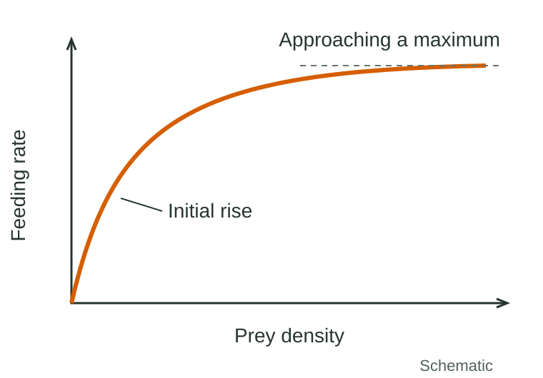
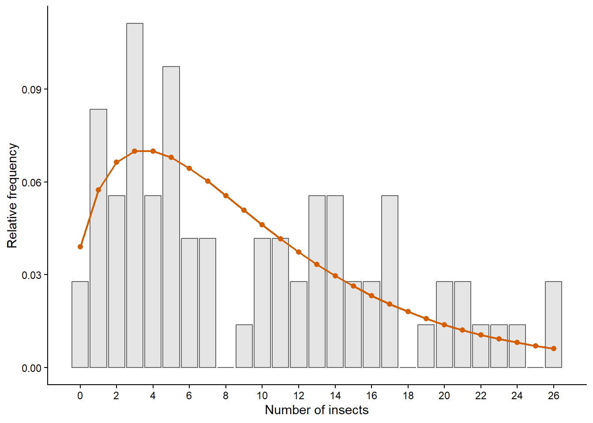
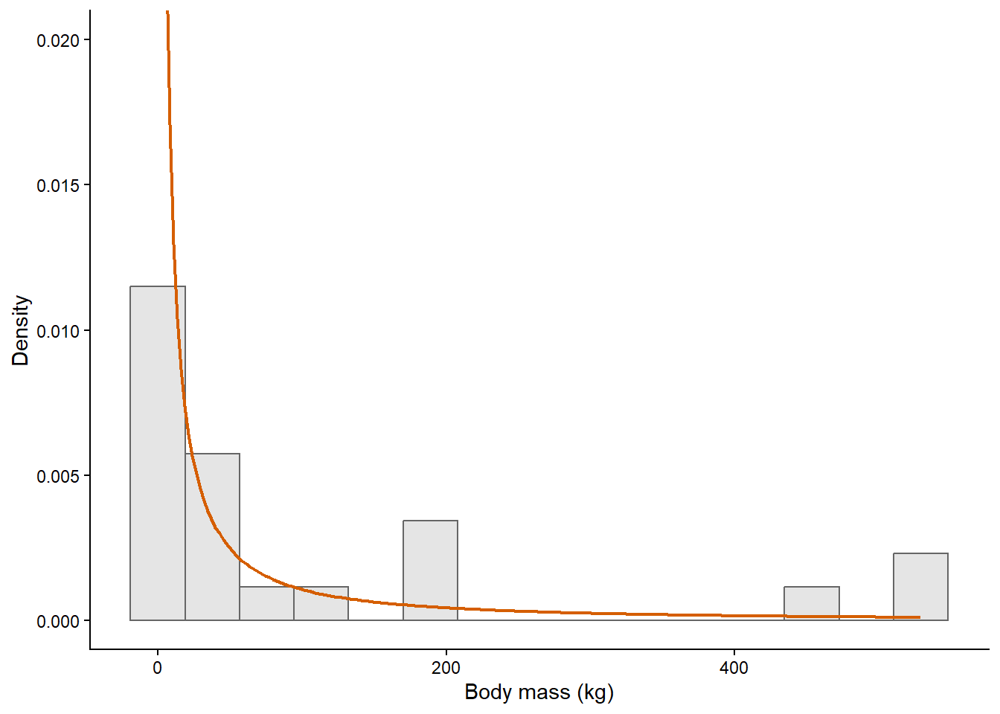
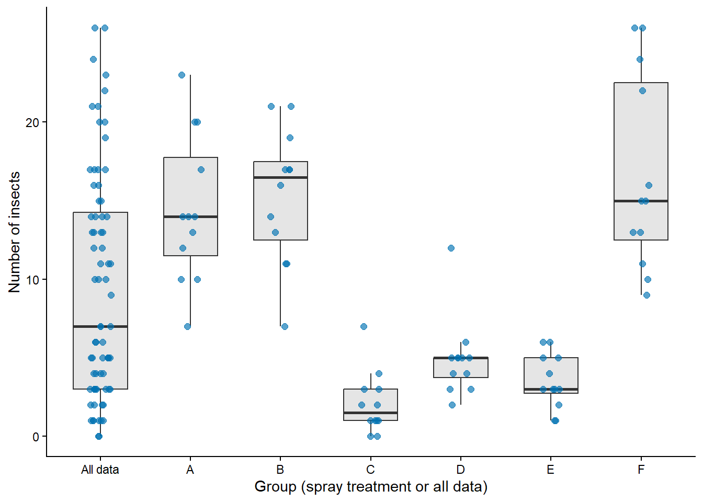
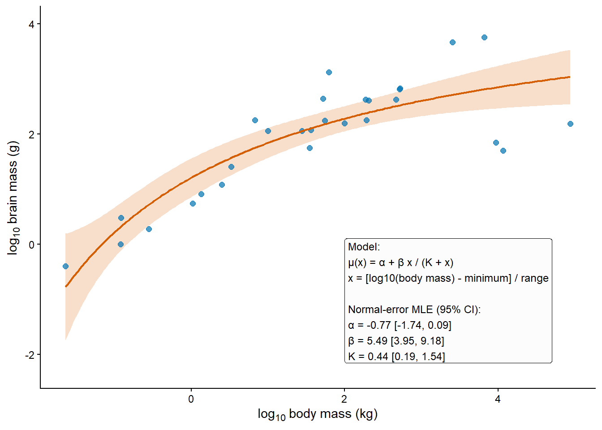

## The purpose of the course {.opening data-timing="120"}

::: {.eyebrow}
Chapter 1 · Ecological models and data
:::

::: {.course-title}
Ecological modelling and data analysis in R
:::

- Ecological knowledge helps us propose models.
- Probability describes variation in observations.
- Data help us estimate, compare and check those models.

::: {.takeaway}
The aim is an answer to an ecological question.
:::

::: {.notes}
**Timing: 2 minutes · 0–2 minutes from the start.**

**Speaker notes**

In this chapter, we learn how to connect ecological questions, models and data.
That connection is the purpose of the whole course.

In ecology, we learn models of feeding, growth, survival and responses to the
environment. In statistics, we learn methods for analysing data. Here we bring
those two things together. We will use ecological knowledge to propose a model,
use probability to describe the variation that it leaves unexplained, and use
data to estimate its parameters.

The result should tell us something about the ecological system: how a response
changes, how large an effect is, or which of several explanations describes the
data more adequately. We also need to say how uncertain that answer is.

We will build the tools gradually. Today is an overview of the reasoning, so you
do not need to know how to fit any of the models that appear in the examples.

**Delivery**

Allow a brief show of hands: “Who has used an ecological model? Who has analysed
ecological data?” Use the responses to gauge experience, without turning this
into a discussion of software.

Optional personal introduction: the chapter contains your account of reading
Bolker's *Ecological Models and Data in R*. If you want to include it, substitute
that account for part of these notes, keeping this slide within two minutes.
:::

## Ecological questions {data-timing="180"}

| Starting question | A quantitative ecological question |
|---|---|
| Does temperature affect development? | How does development change with temperature, and is there an optimum? |
| Does a treatment affect seedling survival? | How much does survival change, and what might that mean for recruitment? |

::: {.takeaway}
To answer my ecological question, I need to estimate…
:::

::: {.activity}
**30 seconds:** make “Does food availability affect growth?” more specific.
:::

::: {.notes}
**Timing: 3 minutes · 2–5 minutes from the start.**

**Speaker notes**

The way we ask a question affects what we need from an analysis. Asking whether
temperature has an effect gives us a rather broad starting point. Asking how
development changes across the observed temperature range tells us more clearly
what relationship we need to describe. Asking whether there is an optimum also
gives us a reason to consider a curve that can rise and then fall.

Similarly, a treatment could change seedling survival by a small amount or a
large amount. Those changes could have quite different ecological consequences.
An analysis that estimates the change and its uncertainty gives us information
we can use in thinking about recruitment.

A useful habit throughout the course is to finish this sentence: “To answer my
ecological question, I need to estimate…” That might be a survival probability,
a maximum feeding rate, or a difference between groups.

**Short activity — included in the three minutes**

Give students 30 seconds to suggest a more specific version of “Does food
availability affect growth?” Take one or two answers. Possible answers include
the increase in growth at low food availability, the maximum growth rate, or the
food availability needed to reach a specified growth rate. Accept other answers
that identify a quantity and a relevant range or comparison.

**Transition**

Let us use a feeding response to see how such a question guides a model.
:::

## A predator's feeding response {data-timing="180"}

:::: {.columns}
::: {.column width="60%"}
{fig-alt="Schematic saturating feeding response: feeding rate rises at low prey density and approaches a maximum at high prey density." .schematic}
:::
::: {.column width="40%"}
- How quickly does feeding increase when prey are scarce?
- Does feeding rate approach a maximum?
- What is that maximum, and how uncertain is it?
:::
::::

::: {.activity}
Where would you measure if your main question was the maximum feeding rate?
:::

::: {.notes}
**Timing: 3 minutes · 5–8 minutes from the start.**

**Speaker notes**

An ecological response function describes how a response changes with a driver.
For example, we might describe feeding rate as a function of prey density.

At low prey density, a predator spends much of its time searching. As prey become
more abundant, feeding can increase. But the predator also needs time to capture
and handle prey, so there is a biological reason to consider a response that
approaches a maximum.

The shape of the function expresses that ecological idea. Its parameters can
describe quantities such as the maximum feeding rate and the prey density at
which feeding reaches half that maximum. We will learn how to analyse functions
like this in Chapter 5 and fit them to observations in Chapter 6.

A straight line might describe a restricted range of prey densities well. The
choice depends on the question and the range of conditions we want to describe.

**Figure discussion**

Point to the rise and plateau. Ask: “Where would you want measurements if your
main question was the maximum feeding rate?” Take an answer, then explain that
data confined to the rising part of the curve may give little information about
the plateau. This is an introduction to the connection between a question, a
model parameter and the data needed to estimate it.
:::

## The components of a statistical model {data-timing="180"}

::: {.definition}
A **model** is a mathematical simplification of a data generating process.
:::

For a fitted response curve, we combine:

:::: {.columns}
::: {.column width="50%"}
### A response function

How the expected response changes.

In the feeding example: the curve.
:::
::: {.column width="50%"}
### A probability distribution

How observations vary around that response.

In the feeding example: variation at a given prey density.
:::
::::

::: {.notes}
**Timing: 3 minutes · 8–11 minutes from the start.**

**Speaker notes**

A statistical model is a mathematical approximation to the process that
produces our data. That process includes what happens ecologically and how we
observe it.

For the feeding example, one part of the model describes how expected feeding
changes with prey density. Another part describes the possible observations at
each prey density. Different predators could consume different numbers of prey,
even under the same experimental conditions.

The response function and the probability distribution therefore do different
jobs. The first describes a systematic relationship; the second describes the
variation that remains. We need both if we want to fit a response curve and
quantify uncertainty.

Some questions only require a probability distribution, for example when we
describe counts under one set of conditions. We begin with those simpler models
before adding response functions and differences among groups.

**Delivery**

Return to the schematic on slide 3, or reveal a few illustrative points around
the curve. Ask students to identify which component describes the curve and
which describes the scatter. Keep this conceptual; distribution names and
equations come later.
:::

## Why probability matters {data-timing="120"}

Probability helps us describe:

- **Observation error:** imperfect recording.
- **Process variation:** ecological variation left unexplained.
- **Parameter uncertainty:** uncertainty about quantities estimated from data.

::: {.takeaway}
These sources of variation also affect uncertainty about predictions.
:::

::: {.notes}
**Timing: 2 minutes · 11–13 minutes from the start.**

**Speaker notes**

For this course, we use probability as a tool for describing unexplained
variation and the uncertainty that follows from it.

There are several reasons why our observations differ. We may record an
ecological quantity imperfectly. Organisms and environments may differ in ways
that our model does not explain. And because the data vary, the parameter values
we estimate from them are uncertain.

These ideas are related, but it helps to distinguish them. An imperfect count,
a difference between organisms, and uncertainty about an estimated mean are
three different things. We will look at each in turn.

The formal probability language comes in Chapter 2. Today we are establishing
what we need that language for.
:::

## Observation error {data-timing="180"}

::: {.definition}
**Observation error:** a difference between what happens and what we record.
:::

- Individuals missed or counted twice.
- Instrument readings with limited precision.
- Differences in how a protocol is carried out.

::: {.example}
**Hypothetical example:** 20 insects are present on a plant; we record 16.
:::

::: {.activity}
Where could observation error enter your own field or laboratory work?
:::

::: {.notes}
**Timing: 3 minutes · 13–16 minutes from the start.**

**Speaker notes**

Observation error concerns the recording process. An animal can be present
without being detected, a count can include the same individual twice, or an
instrument can give a reading that differs from the quantity being measured.

For a hypothetical example, suppose twenty insects are present on a plant but
we record sixteen. The difference belongs to the observation process. The
number actually present has not changed because we missed some insects.

The protocol matters. A survey carried out for longer, with a different observer,
or under different visibility conditions may have different observation error.
So choosing a probability model involves thinking about how the observations
were collected as well as what the numbers look like.

Repeated observations of the same underlying situation can help us investigate
measurement variation, provided that the situation itself stays sufficiently
stable. The design determines what we can learn about the observation process.

**Discussion**

Ask for one example of observation error from students' own field or laboratory
experience. Use it to identify the quantity of interest and the recording step
where error could enter.
:::

## Process variation {data-timing="180"}

::: {.definition}
**Process variation:** ecological variation left unexplained by the model.
:::

- Environmental differences and unmeasured drivers.
- Differences among individuals.
- Demographic events such as survival and reproduction.
- Ecological relationships simplified by the model.

::: {.takeaway}
It remains even with perfect observations.
:::

::: {.notes}
**Timing: 3 minutes · 16–19 minutes from the start.**

**Speaker notes**

Process variation concerns the ecological system itself. Two plants can have
different insect abundances even if we count both perfectly. They may differ in
size, condition, exposure to predators or local environment.

We call this process variation, or process error, when the model leaves those
differences unexplained. The word “error” here does not mean that someone made
a mistake. It describes a difference between what the model explains and what
the system does.

Some variation comes from chance events, such as whether an individual survives.
Some comes from factors that could be measured or represented in a more detailed
model. If we add an informative predictor, part of what was previously
unexplained may become explained.

That is why unexplained variation does not necessarily mean that a process is
fundamentally unpredictable. It is variation relative to the information and
model we currently have.

**Discussion**

Ask: “If we counted every insect perfectly, would all plants have the same
count?” Take a reason for the answer and relate it to one of the listed sources.
:::

## Probability models for ecological observations {.two-plots data-timing="240"}

Different kinds of observations need different probability models.

:::: {.columns}
::: {.column width="50%"}
### Insect counts

{fig-alt="Pooled InsectSprays counts: grey bars show relative frequencies; orange points and line show fitted Negative Binomial probabilities."}

Discrete, non-negative values · **Negative Binomial**
:::
::: {.column width="50%"}
### Animal body masses

{fig-alt="Animals body masses no greater than 2000 kg: grey bars show an observed density histogram; the orange curve shows a fitted LogNormal density."}

Positive continuous measurements · **LogNormal**
:::
::::

::: {.caption}
Grey bars: observations. Orange marks or curve: fitted model. Sampling and measurement
procedures also matter.
:::

::: {.notes}
**Timing: 4 minutes · 19–23 minutes from the start.**

**Speaker notes**

A probability distribution describes the possible values of an observation
and how probability is allocated to them.

These two panels illustrate why we need several distributions. Insect counts
are whole numbers starting at zero. Body mass is a positive continuous quantity,
and in this example the observed values are strongly skewed: many are relatively
small and a few are much larger.

The grey bars summarise the observations. The coloured marks or curve show a
fitted probability model. The distributions used here are called Negative
Binomial and LogNormal. You will meet them in the course; there is no need to
memorise their formulae today.

There is also a distinction between the panels' vertical axes. For counts we
can assign probability to each possible count. For a continuous measurement,
probability is represented by area under a density curve over an interval. We
will develop that distinction in Chapter 2.

These plots describe observed variation. A fitted distribution alone does not
separate the contribution of measurement error from ecological differences.
We need information about the study and its design to investigate that.

**Figure discussion — allow about two minutes**

Ask students to identify the observed values and the model description in each
panel. Then ask: “Could an insect count be negative? Could it be 3.5?” Use the
answers to explain that a model should respect the possible values of the
quantity it describes. Avoid starting a detailed comparison of distributions.
:::

## Explaining some of the variation {.figure-slide data-timing="240"}

:::: {.columns}
::: {.column width="65%"}
{fig-alt="Boxplots and raw InsectSprays counts, first pooled as All data and then separated into spray treatments A to F."}
:::
::: {.column width="35%"}
**The same insect counts, with spray treatment revealed**

- Pooled counts combine several treatments.
- Treatment helps explain differences in counts.
- Variation remains within each treatment.
:::
::::

::: {.activity}
What information do we lose when we put every count in one group?
:::

::: {.notes}
**Timing: 4 minutes · 23–27 minutes from the start.**

**Speaker notes**

An informative predictor can help explain variation that was previously
unexplained. Here we return to the same insect counts, but now include a piece
of information that was hidden in the previous plot: the spray treatment.

Pooling all counts puts differences among treatments together with differences
within treatments. Once we separate the groups, we can see that their typical
counts differ. Treatment is therefore a candidate explanatory variable for a
model of these observations.

There is still variation within each treatment. That could include ecological
differences among experimental units and observation error. The figure does
not determine their separate contributions.

This is the connection to more detailed models. We can describe how a response
changes with a predictor, or how parameters vary among groups, while retaining
a probability distribution for the remaining variation.

**Figure discussion — allow about two minutes**

Ask: “What information do we lose when we put every count in one group?” Then
ask: “What variation remains after we account for treatment?” Point to the
between-group pattern and within-group spread as students answer. Describe
the visible differences without making a new significance claim.

**Transition**

Once we propose a model, we still have to determine its parameter values.
:::

## Parameters and estimates {data-timing="180"}

::: {.definition}
**Parameter:** a quantity that determines a feature of the model.
:::

Examples:

- A mean count.
- A probability of survival.
- A maximum feeding rate.

::: {.definition}
**Estimate:** a value calculated from the observed data.
:::

::: {.notes}
**Timing: 3 minutes · 27–30 minutes from the start.**

**Speaker notes**

A parameter is a quantity that determines a feature of the model. A model for
survival may have a parameter describing the probability of survival. A feeding
response may have a parameter describing its maximum rate. A probability model
may also have parameters that describe how much observations vary.

Once we choose the model, we use data to estimate those quantities. The model
parameter and the estimate play different roles: the parameter belongs to the
mathematical model, while the estimate is the value we obtain by applying an
estimation procedure to the observations.

Another sample from the same study design would generally give a different
estimate. That is the reason we need to study estimation procedures and
quantify uncertainty, rather than report a fitted value alone.

In Chapter 3 we introduce that reasoning through samples and repeated
hypothetical experiments. Chapter 4 develops maximum likelihood, the estimation
method used through the rest of the course.

**Check for understanding**

Point back to the feeding curve: “Which feature could be controlled by a
parameter?” Take one answer, then ask what data would help estimate it.
:::

## Parameter uncertainty {.figure-slide data-timing="240"}

:::: {.columns}
::: {.column width="65%"}
{fig-alt="Log10 brain mass against log10 body mass for all 28 Animals species, including three dinosaurs. Blue points are observations, the orange curve is the fitted mean response, and the band gives approximate 95% confidence intervals for that mean."}
:::
::: {.column width="35%"}
**Finite samples vary.**

- Several nearby parameter values can be compatible with the observations.
- We report estimates with uncertainty.
- Uncertainty about a mean response differs from variation among observations.
:::
::::

::: {.caption}
Points: species. Line: fitted mean. Band: approximate 95% confidence intervals for the
mean response. Both axes use logarithms.
:::

::: {.notes}
**Timing: 4 minutes · 30–34 minutes from the start.**

**Speaker notes**

Parameter uncertainty concerns how precisely the data allow us to determine
the quantities in our model. Because samples vary, several similar response
curves may be compatible with one observed dataset.

Here the points represent body mass and brain mass for different species. Both
axes use logarithms because the measurements cover a wide range of sizes. The
line describes the fitted mean response, and the shaded band shows approximate
95% confidence intervals for that mean response at the displayed body masses.

The spread of the points and the shaded band represent different things. The
points show differences among observed species. The band represents uncertainty
about the estimated mean relationship. We should not expect it to contain 95%
of the individual species.

There is an ecological qualification to this example: three of the species are
dinosaurs with very large bodies and relatively small brains. They strongly
influence the apparent levelling-off. Which organisms we include can affect
the relationship we describe.

We will use frequentist methods for uncertainty in this course. Their
interpretation depends on what would happen across repeated hypothetical
samples; Chapters 3 and 4 explain that in detail.

**Figure discussion — allow about two minutes**

Ask: “What does a point represent? What does the line represent? What does
the band represent?” Give students time to distinguish all three before
continuing. Keep the discussion on interpretation rather than calculating
confidence intervals.
:::

## Discussion: variation and uncertainty {data-timing="180"}

Which concept is illustrated in each case?

1. Two observers record different counts of the same animals at the same moment.
2. Perfect counts show different abundances on two plants with the same treatment.
3. Repeating a study gives a different estimate of mean abundance.

::: {.takeaway}
Observation error · Process variation · Parameter uncertainty
:::

::: {.activity}
**45 seconds:** think or discuss with a neighbour, then explain your choices.
:::

::: {.notes}
**Timing: 3 minutes · 34–37 minutes from the start.**

**Activity — three minutes in total**

Give students 45 seconds to think or discuss with a neighbour. Spend about
90 seconds taking answers, then use the remaining time for the explanation below.

**Speaker notes / answers**

In the first case, the underlying set of animals is the same. The difference
is in what the observers record, so this illustrates observation error.

In the second case, perfect observation still leaves a difference between the
plants. Relative to a model that only includes treatment, that is process
variation. We might explain some of it by measuring additional plant or
environmental characteristics.

In the third case, the quantity that changes is the estimate from a study.
That illustrates why the estimated mean has uncertainty. Each study can contain
many observations, but the variation here is between estimates from repeated
studies.

All three can occur in one analysis. We distinguish them so that we can be clear
about what a probability distribution or an uncertainty statement describes.
:::

## Other sources of uncertainty {data-timing="60"}

Wider modelling applications also involve uncertainty about:

- Initial conditions and future environmental inputs.
- Candidate models and future scenarios.
- Numerical approximations.

::: {.takeaway}
This course focuses on observations, fitted response curves and their uncertainty.
:::

::: {.notes}
**Timing: 1 minute · 37–38 minutes from the start.**

**Speaker notes**

There are other applications of probability in ecological modelling. We may be
uncertain about the starting state of a system, future rainfall or which model
to use. Alternative future scenarios and numerical approximations also affect
predictions.

These issues matter particularly when modelling change through time. This course
focuses on analysing ecological observations and fitting response curves, so we
will not develop dynamical or forecasting methods. We will compare candidate
models and learn to describe uncertainty in the relationships we estimate.
:::

## What we want from a statistical analysis {data-timing="180"}

A useful ecological analysis asks:

- How large is the response, and what shape does it have?
- How uncertain are the estimates?
- Which plausible models describe the data more adequately?
- Does the fitted model capture the features we need to explain?

::: {.takeaway}
Linear, generalised linear and mixed models remain useful where they suit the question.
:::

::: {.notes}
**Timing: 3 minutes · 38–41 minutes from the start.**

**Speaker notes**

Many of us first encounter statistics through linear models, analysis of variance
and tests of whether a coefficient differs from zero. Those methods remain useful.
The course gives us a way to make the ecological relationship and probability
assumptions explicit, including when a familiar model is an appropriate choice.

A p-value addresses a particular test under a set of assumptions. It does not
give us the size of an effect, the shape of a response or the precision of an
estimated ecological quantity. A large p-value can also occur when the data are
too limited or variable to resolve a response clearly.

For the feeding example, we want to estimate how the response rises and where it
levels off. We then need uncertainty, a comparison with plausible alternatives,
and checks of how adequately the model describes the observations.

Modern numerical methods let us fit a wider range of models. Ecological judgement
is still needed to decide which relationships are meaningful and whether the
data contain enough information to estimate them.

**Discussion**

Ask: “If I tell you that prey density has a statistically significant effect,
which of our questions about the feeding curve are still unanswered?” Refer to
slide 3 and take two answers.
:::

## The modelling cycle {.diagram-slide data-timing="240"}

{fig-alt="The ecological modelling cycle: research questions guide the choice of model and data; estimation connects both to an ecological answer, and model comparison feeds back into the cycle." .cycle-diagram}

::: {.caption}
Questions guide data and models; estimation, comparison and checking can lead us back.
AIC is introduced in Chapter 4 and developed further in Chapter 6.
:::

::: {.notes}
**Timing: 4 minutes · 41–45 minutes from the start.**

**Speaker notes**

This figure puts the ideas together. We begin with an ecological question and
use what we know about the system to decide what data and models are relevant.

Follow the cycle. We propose a model that can describe the observations, combine
it with data to estimate parameters, and interpret the result in terms of the
question. Often more than one model is plausible, so comparison is part of the
analysis as well.

For the feeding example, the question could be the maximum feeding rate. We need
observations across suitable prey densities, a candidate response function, and
a probability distribution for feeding observations. Fitting gives estimates
and uncertainty. Comparison and checking help us judge how useful that
description is.

The arrows can lead us back. We may find that the data give little information
about the maximum, that another response shape is plausible, or that a feature
of the study needs to be represented in the model. The result can therefore
change the next experiment or the next model we consider.

The chapter numbers show where we develop the tools. We will return to that
roadmap shortly; for now, follow the reasoning around the cycle.

**Figure walkthrough — included in the four minutes**

Trace the question, data, model, estimation and answer with a pointer. Then ask:
“Suppose our fitted curve still rises at the highest prey density we measured.
What might we revisit?” Accept extending the measurements, reconsidering the
candidate functions, or narrowing the claim to the observed range. Explain that
the appropriate response depends on the evidence and the ecological question.
:::

## Reality, model and data {.diagram-slide data-timing="240"}

:::: {.columns}
::: {.column width="59%"}
{fig-alt="Data generating process, model and data, linked to parameters and estimates. Solid arrows show derivation; dashed arrows show approximate statistical relationships assumed for estimation." .estimation-diagram}
:::
::: {.column width="41%"}
**Solid arrows:** quantities derived from data, reality or mathematical structures.

**Dashed arrows:** approximate statistical relationships assumed for estimation.

We treat observations as if they were a random sample from the model.
:::
::::

::: {.notes}
**Timing: 4 minutes · 45–49 minutes from the start.**

**Speaker notes**

This second figure looks more closely at estimation. The data generating process
includes the ecological events, experimental procedures and measurements that
produce the observations. Our model is a mathematical approximation to that
process.

For the feeding experiment, the real process includes prey encounters, capture,
handling, differences among predators, and how feeding is recorded. The model
retains the features that we think are relevant to the question and feasible
to estimate from the data.

To develop an estimation procedure, we treat the observations as if they were
a random sample from the model. That assumption provides a mathematical link
between parameter values and possible datasets. We can then use the observed
sample to calculate estimates.

We also ask how the procedure would behave across repeated hypothetical samples:
whether estimates tend to be systematically high or low, how much they vary, and
how well their intervals describe uncertainty. That is the frequentist reasoning
developed in Chapters 3 and 4.

Maximum likelihood is our main estimation method. Informally, it selects
parameter values that make the observed data most compatible with the specified
probability model. We will define that precisely when we reach Chapter 4.

**Figure walkthrough**

Follow the solid arrows, then the dashed arrows, using the actual labels in your
figure. Explain that the dashed relationships are approximate statistical
relationships assumed for estimation. Ask students where a missed insect or
an imperfect instrument belongs in the diagram: it belongs in the real
observation process that helps generate the data.
:::

## Course roadmap: distributions to estimation {.roadmap data-timing="180"}

| Chapter | Main question |
|---|---|
| **1. Ecological models and data** | How do questions, models and data connect? R foundations in the practical. |
| **2. Probability distributions** | What observations can a model produce, and with what probabilities? |
| **3. From samples to estimates** | What can a finite sample tell us, and how do estimates vary? |
| **4. Maximum likelihood estimation** | How do we estimate parameters, quantify uncertainty and compare models? |

::: {.notes}
**Timing: 3 minutes · 49–52 minutes from the start.**

**Speaker notes**

The first part of the course develops the probability and estimation tools.
Chapter 2 begins with distributions: what values an observation can take, how
probabilities are described, and how to simulate observations. We use a Binomial
model for seed survival and a Normal model for penguin measurements, alongside
other ecological examples.

Chapter 3 changes the direction of the question. We have a sample and want to
learn about unknown parameters. We investigate how samples and estimates vary
and what that means for uncertainty.

Chapter 4 introduces maximum likelihood. We write the probability model
explicitly, estimate its parameters, calculate uncertainty and begin comparing
candidate models with the Akaike information criterion, or AIC.

The R tools are introduced as we need them. Probability calculations use RTMB
and RTMBdist from Chapter 2, and fitting uses RTMB with numerical optimisation
from Chapter 4. You do not need to understand those packages today.

**Delivery**

Use one sentence per row first, then explain the change from generating possible
observations in Chapter 2 to estimating unknown quantities in Chapters 3 and 4.
Do not expand this into a list of every distribution or uncertainty method.
:::

## Course roadmap: ecological response curves {.roadmap data-timing="120"}

| Chapter | Main question |
|---|---|
| **5. Deterministic functions in ecology** | Which functions describe plausible ecological relationships? |
| **6. Fitting ecological response curves** | How do we combine functions and distributions, fit, compare and check models? |
| **7. Grouped ecological response curves** | How do we describe differences among groups and repeated observations? |
| **8. Numerical optimisation** | How do we diagnose and address difficult numerical fits? |

::: {.notes}
**Timing: 2 minutes · 52–54 minutes from the start.**

**Speaker notes**

Chapter 5 develops the ecological response functions. We study their shapes,
the meaning and units of their parameters, and how ecological reasoning helps
us choose candidates. That chapter studies the functions themselves; fitting
them comes next.

Chapter 6 brings those functions together with the probability distributions
and estimation methods. We fit ecological response curves, compare candidates,
check their fit and interpret their parameters and uncertainty.

Chapter 7 extends the approach to groups and repeated observations. We learn
how to describe shared relationships and variation among groups.

Chapter 8 deals with the numerical difficulties that can arise when fitting
models. It helps us understand and diagnose the searches that our fitting
tools perform.

The detailed roadmap in Chapter 1 is a reference you can return to as you work
through the course. Today, the main connection to remember is that functions,
probability distributions and data come together in a fitted ecological model.
:::

## The Chapter 1 R practical {data-timing="180"}

R skills we will use throughout the course:

- **Scripts and projects:** keep an analysis reproducible and organised.
- **Vectors, matrices, lists and data frames:** store and work with data and results.
- **Plots:** inspect observations and model descriptions.
- **Functions and loops:** express models and repeat calculations.

::: {.takeaway}
Run the examples, attempt the exercises and explain the results.
:::

::: {.notes}
**Timing: 3 minutes · 54–57 minutes from the start.**

**Speaker notes**

The Chapter 1 practical develops the R skills that make this workflow possible.
R is the language we use for calculations, and RStudio helps us write and
organise the work.

We will store commands in scripts so that we can rerun an analysis. We will
learn how to store observations, select and summarise data, and make plots.
Writing functions lets us express a model or a calculation once and use it for
different inputs. Loops let us repeat operations, which becomes useful when
we simulate studies later in the course.

Work through the tutorial in order and run the examples yourself. When you
change a line, try to predict what will happen before you run it. If a result
surprises you, that is something to investigate.

The practical also includes package installation and finding help. AI can help
explain a concept or debug a command, but use it in a way that develops your
understanding. You should still be able to explain what your code does and what
its result means ecologically.

**Delivery**

Open the practical briefly, or show a screenshot of its contents, to make clear
where students will practise. Point out the sections on scripts, functions and
exercises. Keep installation, schedules and assessment details in your logistics
segment. A live coding demonstration is optional; it should replace part of
this slide's three minutes rather than extend the lecture.
:::

## Summary and closing questions {.closing data-timing="180"}

- An ecological question guides the model and the data we need.
- Probability describes observation error and unexplained process variation.
- Estimates need uncertainty and ecological interpretation.
- Fitting, comparison and checking form an iterative modelling cycle.

::: {.activity}
**Closing questions**

1. Why does a feeding response curve need a probability model for observations?
2. How does variation among observations differ from uncertainty about a parameter?
:::

::: {.notes}
**Timing: 3 minutes · 57–60 minutes from the start.**

**Speaker notes**

The course connects ecological knowledge with statistical analysis. We use a
model to express a relationship and a probability distribution to describe
variation in the observations. We then use data to estimate the parameters,
describe their uncertainty, compare plausible alternatives and check the fit.

Throughout that process, we return to the ecological question. An estimate
becomes useful when we understand what it measures, its units, its uncertainty
and how it helps answer that question.

Before we finish, let us check the two distinctions on the slide.

**Discussion and expected answers — allow about two minutes**

For question 1: the curve describes an expected relationship, while observations
at the same prey density can differ. A probability model represents that
variation and provides the basis for estimation and uncertainty.

For question 2: variation among observations concerns differences in the data,
including process variation and observation error. Parameter uncertainty
concerns how precisely a sample lets us determine a model quantity; repeated
hypothetical studies generally produce different estimates.

**Final transition**

The next step is to learn the R tools in the practical and the probability
language in Chapter 2. Those are the foundations for writing and fitting the
models that will answer our ecological questions.

**Adjustments during delivery**

If discussion runs long, keep the sequence but shorten slides 13, 17 and 18.
Slide 13 can become one spoken sentence, and the two roadmap slides can be
shown together with a brief explanation of the progression. This recovers
roughly three minutes. Preserve the distinction between variation and parameter
uncertainty and the explanation of the two modelling figures.

If you prefer a break within the Chapter 1 content, place it after slide 12
(37 minutes of content). The break is additional to the sixty-minute script.

If time remains in the wider session, return to the feeding example and ask
students to propose an experiment: what they would measure, which prey densities
they would include, and what observation problems they would anticipate. This
extends the modelling-cycle discussion without introducing a new method.
:::
